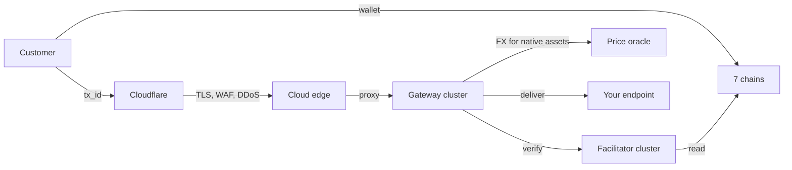

## The four-tier shape

Four tiers, each with a single responsibility:

- **Cloudflare** sits in front of every public hostname. TLS termination, WAF rules, DDoS mitigation, and bot scoring happen here before any AlgoVoi origin sees the request. Cloudflare is also where rate-limit overrides, geo-routing, and Authenticated Origin Pulls are configured.
- **Cloud edge** is a thin proxy behind Cloudflare. It hosts inbound webhooks for chat-bot platforms (Telegram, Viber, Discord), the payment-status sync from outbound deliveries, and a small set of public read endpoints. The edge doesn't carry any payment logic. Everything routes back to the gateway cluster.
- **Gateway cluster** is the canonical entry point for all payment protocol traffic. It owns x402, MPP, AP2, A2A skills, hosted checkout, the cloud event bridge, and the database. The public hostname is `api1.ilovechicken.co.uk`.
- **Facilitator cluster** verifies on-chain transactions. It calls each chain's RPC or indexer and returns yes-or-no plus the extracted amount, asset, and sender. The facilitator is **stateless**: it doesn't know which tenants exist or which checkouts are open. It just answers "did this transaction settle this exact amount of this exact asset to this exact address?".

## Why split this way

Three reasons for the split:

1. **Edge-layer defence.** Cloudflare absorbs unauthenticated traffic, bot probes, and volumetric attacks so the AlgoVoi origins see only filtered requests.
2. **Latency to chains.** The facilitator is data-centre-co-located near the chains it verifies. The gateway can run anywhere.
3. **Public surface area.** The cloud edge takes the hit of public-internet traffic from chat platforms (which have strict webhook timeouts and unpredictable bursts) without exposing the gateway directly.

## Trust boundaries

- **Gateway → facilitator** is the only path that touches private chain RPC keys. The facilitator's outbound RPC connections are hidden behind the cluster.
- **Cloud edge → gateway** uses a private VPC route on a static internal IP. No public-internet hop.
- **External → gateway** is fronted by Cloudflare with strict origin firewall rules.

## Database

Postgres is used throughout.

## Price oracle

A managed price oracle converts native-asset amounts (ALGO, VOI, HBAR, XLM, ETH, SOL) into USD cents at confirmation time. Stablecoin payments don't use it (USDC at six decimals divides cleanly into cents); native-asset payments do. The oracle is what lets the trial allowance and the volume tiers stay denominated in USD even when the underlying chain is paid in a volatile asset.

Multiple feeds are consulted with median outlier rejection. If the oracle is unavailable, native-asset payments are queued rather than failed, and confirmation latency increases until the feed recovers.

## Encryption at rest

Two classes of sensitive data, two separate encryption keys, both AES-128-CBC + HMAC-SHA256 (Fernet) with multi-key rotation support.

- **Tenant secrets** (API keys, webhook secrets, OAuth tokens, MFA TOTP seeds) are encrypted with the platform's primary key. Used by the dashboard and the gateway when reading config rows.
- **KYC and KYB documents** (passport scans, biometric selfies, proofs of address, beneficial-owner passports, source-of-funds letters) are encrypted with a **separate key** so that a compromise of one class of data cannot expose the other. Every document on disk carries an `AVK1` magic header so the loader can verify the file is encrypted before serving it.

Both key stacks support zero-downtime rotation (an old key fallback is honoured during a roll). Plaintext only ever exists in memory while a request is being processed: encrypt-then-write on upload, read-then-decrypt on download under admin auth.

## See also

- [Chains overview](/concepts/chains-overview) for what each chain looks like at the verifier level
- [Notifications](/concepts/notifications) for how outbound deliveries fan out
