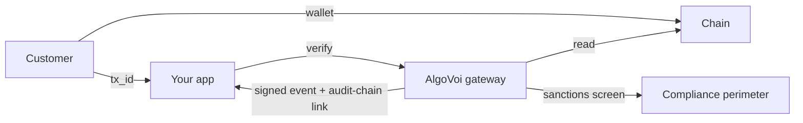

## What AlgoVoi is

AlgoVoi is the compliance layer for stablecoin payments. The same gateway that handles settlement across seven blockchains also runs continuous sanctions screening, KYB gating, and audit-chain shipping on every payment — so when a merchant or autonomous agent sends funds through us, the principal isn't quietly carrying UK MLRs / OFAC / SAMLA exposure they didn't sign up for.

Practically, AlgoVoi turns any web endpoint, agent, bot, or e-commerce store into something you can charge money for. Point your customers at a checkout link, point an agent at an x402-protected URL, or point an MCP tool at an MPP-priced method, and we handle the rest — inside a compliance perimeter you can publicly attest to.

What you get out of the box:

- **Compliance from day one.** Multi-source sanctions screening (OFSI / OFAC / UN / EU, daily refresh). Public [`/compliance/attestation`](https://api.algovoi.co.uk/compliance/attestation) and [`/compliance/screen`](https://api.algovoi.co.uk/compliance/screen) endpoints any agent can call before paying. SHA-384 audit chain shipped to Object Lock storage. SAMLA-2018-s.20-tipping-off compliant by design — generic verdicts, never names a list.
- **Agent-protocol native.** First-class support for [x402](/protocols/x402), [MPP](/protocols/mpp), [AP2](/protocols/ap2), [A2A v1.0](/protocols/a2a), and [Solana Actions](/protocols/solana-actions). First **compliance-aware [Bazaar](https://github.com/coinbase/x402/blob/main/docs/extensions/bazaar.mdx) facilitator** — every entry in our `/discovery/resources` carries embedded compliance metadata.
- **One integration, seven chains.** Algorand, VOI, Hedera, Stellar, Base, Solana, and Tempo all sit behind the same gateway, the same API, and the same dashboard. Cross-chain (xChain) settlement so a customer holding USDC on any of seven EVM source chains can pay a destination-chain checkout from MetaMask.
- **Direct settlement.** Funds land on-chain in your wallet. AlgoVoi never holds your money, so there is no platform float, no payout schedule, and no Stripe-style settlement delay.
- **Stablecoin-first.** USDC on every chain we support, plus chain-native tokens where they make sense.

## Who AlgoVoi is for

<CardGroup cols={2}>
  <Card title="Agent builders" icon="robot">
    Charge per request for x402-gated APIs, AP2 mandates, MPP-priced MCP tools, or A2A skills. Pre-screen recipients with `/compliance/screen` before your agent transmits funds — protective layer between "model decides to pay" and "principal carries the liability".
  </Card>
  <Card title="Compliance-aware merchants" icon="shield-check">
    KYB-screened onboarding, risk-tier classification, multi-source sanctions screening on every payer, SHA-384 audit-chain receipts. UK MLRs 2017 + SAMLA 2018 + UK GDPR aligned. Public attestation surface for due-diligence packs.
  </Card>
  <Card title="E-commerce operators" icon="cart-shopping">
    Drop-in adapters for Shopify, WooCommerce, BigCommerce, OpenCart, PrestaShop, Shopware, Ghost, Calendly, Xero, and dozens more. Compliance gating runs automatically — you don't have to build it.
  </Card>
  <Card title="Chat-bot operators" icon="comments">
    Take USDC payments inside Discord, Telegram, X, and Viber. Typing `pay £5` is enough. Same compliance perimeter as every other AlgoVoi payment surface.
  </Card>
</CardGroup>

## How AlgoVoi compares

| | AlgoVoi | Coinbase Commerce | NowPayments | Stripe Crypto |
| --- | --- | --- | --- | --- |
| Sanctions screening | **OFSI / OFAC / UN / EU, daily refresh** | Limited disclosure | Basic AML | Stripe-managed |
| Public compliance attestation | **`/compliance/attestation`** | Not exposed | Not exposed | Not exposed |
| Pre-payment recipient screen | **`/compliance/screen` (SAMLA-compliant)** | None | None | None |
| Audit chain | **SHA-384, Object Lock 7y** | Closed | Closed | Closed |
| Agent payment protocols | **x402, MPP, AP2, A2A** | None | None | None |
| Bazaar discovery extension | **Compliance-aware facilitator** | Coinbase-operated | None | None |
| Chains | **7 mainnets** | 4 | 60+ | 2 |
| Take rate | **0.50%** post-trial | 1% | 0.5 to 1% | 1.5% |
| Holds your money | No | No | Yes | Yes |
| KYB / KYC | Auto-approve for individuals | Light | Basic AML | Full Stripe KYC |
| Free trial | **\$1,000 mainnet across 7 chains** | \$0 | \$0 | \$0 |

## The shape of an integration

There are three actors: your customer, your app, and the AlgoVoi gateway. The customer pays on-chain, your app asks AlgoVoi to verify the transaction, and AlgoVoi reads the chain — but before signing the webhook event back to you, the payer wallet is screened against our sanctions cache, the payment is added to the SHA-384 audit chain, and the verdict is recorded for due-diligence retrieval. All the chain-specific complexity (memo formats, asset IDs, RPC failover, CAIP-2 network IDs) and all the compliance machinery (sanctions feeds, KYB state, risk tiers, audit-chain shipping) sit inside the gateway. You never have to think about either.

## What's next

<CardGroup cols={2}>
  <Card title="Quickstart" icon="rocket" href="/quickstart">
    Take your first payment in five minutes.
  </Card>
  <Card title="Compliance overview" icon="shield-check" href="/compliance">
    Frameworks asserted, screening sources, audit-chain mechanics, and how to request the NDA-tier compliance binder.
  </Card>
  <Card title="Trial and pricing" icon="dollar-sign" href="/trial-and-pricing">
    The free \$1,000 mainnet allowance and how billing works.
  </Card>
  <Card title="Pick a protocol" icon="puzzle-piece" href="/protocols/x402">
    x402, MPP, AP2, A2A, or hosted checkout. Choose what fits your use case.
  </Card>
</CardGroup>
