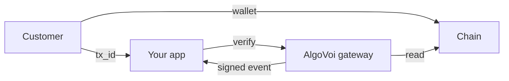

## What AlgoVoi is

AlgoVoi turns any web endpoint, agent, bot, or e-commerce store into something you can charge money for. Point your customers at a checkout link, point an agent at an x402-protected URL, or point an MCP tool at an MPP-priced method, and we handle the rest.

What you get out of the box:

- **One integration, seven chains.** Algorand, VOI, Hedera, Stellar, Base, Solana, and Tempo all sit behind the same gateway, the same API, and the same dashboard.
- **Direct settlement.** Funds land on-chain in your wallet. AlgoVoi never holds your money, so there is no platform float, no payout schedule, and no Stripe-style settlement delay.
- **Protocol-native.** First-class support for [x402](/protocols/x402), [MPP](/protocols/mpp), [AP2](/protocols/ap2), [A2A v1.0](/protocols/a2a), and [Solana Actions](/protocols/solana-actions).
- **Stablecoin-first.** USDC on every chain we support, plus chain-native tokens where they make sense.

## Who AlgoVoi is for

<CardGroup cols={2}>
  <Card title="Agent builders" icon="robot">
    Charge per request for x402-gated APIs, AP2 mandates, MPP-priced MCP tools, or A2A skills.
  </Card>
  <Card title="E-commerce operators" icon="cart-shopping">
    Drop-in adapters for Shopify, WooCommerce, BigCommerce, Ghost, Calendly, Xero, and dozens more.
  </Card>
  <Card title="Chat-bot operators" icon="comments">
    Take USDC payments inside Discord, Telegram, X, and Viber. Typing `pay £5` is enough.
  </Card>
  <Card title="Developers" icon="code">
    Hosted-checkout links, REST API, signed webhook events, and SDKs for every popular AI framework.
  </Card>
</CardGroup>

## How AlgoVoi compares

| | AlgoVoi | Coinbase Commerce | NowPayments | Stripe Crypto |
| --- | --- | --- | --- | --- |
| Take rate | **0.50%** post-trial | 1% | 0.5 to 1% | 1.5% |
| Free trial | **\$1,000 mainnet across 7 chains** | \$0 | \$0 | \$0 |
| Chains | **7** | 4 | 60+ | 2 |
| Holds your money | No | No | Yes | Yes |
| KYC | Auto-approve for individuals | Light | Basic AML | Full Stripe KYC |
| Agent payment protocols | x402, MPP, AP2, A2A | None | None | None |

## The shape of an integration

There are three actors: your customer, your app, and the AlgoVoi gateway. The customer pays on-chain, your app asks AlgoVoi to verify the transaction, and AlgoVoi reads the chain and signs a webhook event back to you. All the chain-specific complexity (memo formats, asset IDs, RPC failover, CAIP-2 network IDs) sits inside the gateway. You never have to think about it.

## What's next

<CardGroup cols={2}>
  <Card title="Quickstart" icon="rocket" href="/quickstart">
    Take your first payment in five minutes.
  </Card>
  <Card title="Trial and pricing" icon="dollar-sign" href="/trial-and-pricing">
    The free \$1,000 mainnet allowance and how billing works.
  </Card>
  <Card title="Pick a protocol" icon="puzzle-piece" href="/protocols/x402">
    x402, MPP, AP2, A2A, or hosted checkout. Choose what fits your use case.
  </Card>
  <Card title="Pick a chain" icon="link" href="/chains/algorand">
    Per-chain notes, asset IDs, and RPC details.
  </Card>
</CardGroup>
