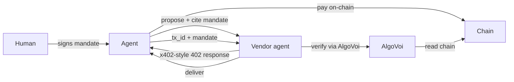

## What is AP2

[Agent Payments Protocol (AP2)](https://github.com/google-agentic-commerce/AP2) is Google's open protocol for AI agents to negotiate, authorise, and settle payments on behalf of humans. Unlike x402's per-request model, AP2 introduces **mandates**: signed, scoped authorisations a human gives an agent. For example, "you may spend up to $50 buying flights from these vendors".

AlgoVoi provides the on-chain settlement extension for AP2. When a mandate is exercised, the resulting payment lands on Algorand, VOI, Hedera, Stellar, Base, Solana, or Tempo as USDC.

## When to use AP2

<CardGroup cols={2}>
  <Card title="Bounded autonomy">
    "Buy any of these 5 SKUs under $20 each, max $100 total this week."
  </Card>
  <Card title="Cross-vendor mandates">
    One mandate authorises an agent to pay multiple vendors without re-confirmation.
  </Card>
  <Card title="Audit-grade commerce">
    Every transaction traces back to a signed human mandate, giving you a strong audit story.
  </Card>
  <Card title="Human-present scenarios">
    Agent proposes, human approves once, then the agent executes without further approvals.
  </Card>
</CardGroup>

## How AP2 differs

| | x402 / MPP | AP2 |
| --- | --- | --- |
| Authorisation | Per-payment | Mandate (multi-payment, scoped) |
| Counter-party signing | Just the payer | Both human and agent |
| Settlement | Direct | Direct (with extension) |
| Best for | Unattended API calls | Agent-mediated purchases |

## Sample scenarios

AlgoVoi has shipped two reference scenarios upstream into the official AP2 samples repo:

<CardGroup cols={2}>
  <Card title="crypto-algo human-present" icon="github" href="https://github.com/google-agentic-commerce/AP2/pull/218">
    Algorand USDC settlement of an AP2 mandate, with full agent and ADK code.
  </Card>
  <Card title="crypto-solana human-present" icon="github" href="https://github.com/google-agentic-commerce/AP2/pull/228">
    Solana Pay reference-binding settlement of an AP2 mandate.
  </Card>
</CardGroup>

These PRs are the canonical reference implementations. The code there is exactly what runs against AlgoVoi's gateway.

## Architecture

AlgoVoi sits in the verifier role, the same as in x402, but the agent is now spending against a pre-signed mandate rather than per-call human approval.

## Live demos

A working [AP2 over A2A v1.0 REST + MCP](https://api1.ilovechicken.co.uk/.well-known/agent.json) demo runs against AlgoVoi's production gateway. The agent card publishes:

- `verify-payment` skill (AP2-compatible verification)
- `create-checkout` skill (agent-initiated AP2 mandate exercise)
- `check-status` skill

## See also

- [A2A](/protocols/a2a) is the transport AP2 typically rides on
- [x402](/protocols/x402) is used inside AP2 for per-call settlement
- The [AP2 spec](https://github.com/google-agentic-commerce/AP2) itself
