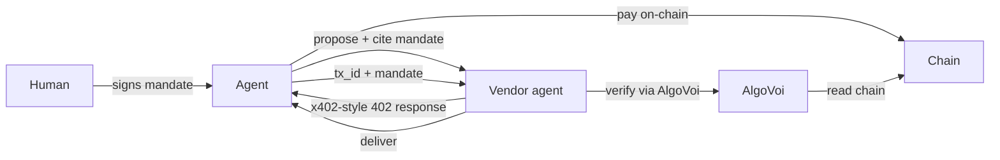

---
title: AP2 (Agent Payments Protocol)
description: Google's mandate-based protocol for autonomous agent commerce. AlgoVoi is the on-chain settlement layer.
---

## What is AP2

[Agent Payments Protocol (AP2)](https://github.com/google-agentic-commerce/AP2) is Google's open protocol for AI agents to negotiate, authorise, and settle payments on behalf of humans. Unlike x402's per-request model, AP2 introduces **mandates**: signed, scoped authorisations a human gives an agent. For example, "you may spend up to \$50 buying flights from these vendors".

AlgoVoi provides the on-chain settlement extension for AP2. When a mandate is exercised, the resulting payment lands on Algorand, VOI, Hedera, Stellar, Base, Solana, or Tempo as USDC.

## When to use AP2

<CardGroup cols={2}>
  <Card title="Bounded autonomy">
    "Buy any of these 5 SKUs under \$20 each, max \$100 total this week."
  </Card>
  <Card title="Cross-vendor mandates">
    One mandate authorises an agent to pay multiple vendors without re-confirmation.
  </Card>
  <Card title="Audit-grade commerce">
    Every transaction traces back to a signed human mandate, giving you a strong audit story.
  </Card>
  <Card title="Human-present scenarios">
    Agent proposes, human approves once, then the agent executes without further approvals.
  </Card>
</CardGroup>

## How AP2 differs

| | x402 / MPP | AP2 |
| --- | --- | --- |
| Authorisation | Per-payment | Mandate (multi-payment, scoped) |
| Counter-party signing | Just the payer | Both human and agent |
| Settlement | Direct | Direct (with extension) |
| Best for | Unattended API calls | Agent-mediated purchases |

## Sample scenarios

AlgoVoi has shipped two reference scenarios upstream into the official AP2 samples repo:

<CardGroup cols={2}>
  <Card title="crypto-algo human-present" icon="github" href="https://github.com/google-agentic-commerce/AP2/pull/218">
    Algorand USDC settlement of an AP2 mandate, with full agent and ADK code.
  </Card>
  <Card title="crypto-solana human-present" icon="github" href="https://github.com/google-agentic-commerce/AP2/pull/228">
    Solana Pay reference-binding settlement of an AP2 mandate.
  </Card>
</CardGroup>

These PRs are the canonical reference implementations. The code there is exactly what runs against AlgoVoi's gateway.

## Architecture



AlgoVoi sits in the verifier role, the same as in x402, but the agent is now spending against a pre-signed mandate rather than per-call human approval.

## Live demos

A working [AP2 over A2A v1.0 REST + MCP](https://api.algovoi.co.uk/.well-known/agent.json) demo runs against AlgoVoi's production gateway. The agent card publishes:

- `verify-payment` skill (AP2-compatible verification)
- `create-checkout` skill (agent-initiated AP2 mandate exercise)
- `check-status` skill

## Canonicalisation conformance

AP2 mandates carry an `open_mandate_hash` field that identifies the mandate stably across the agent, the credential provider, and the merchant. The hash needs to be implementation-independent — two parties must derive the same bytes from the same mandate body, or interop breaks silently.

AlgoVoi follows this derivation rule:

```
open_mandate_hash = SHA-256(JCS_RFC8785(unsigned open-checkout-mandate body))
```

Lowercase hex output. **Hash input is the claims object, not the JWS compact form.** This is the load-bearing interop subtlety — JWS re-encoding by intermediaries changes the envelope even when the underlying payload is identical, which would silently break hash matching between implementations that round-trip through different JWS libraries.

### v0 conformance vectors

We published a 7-vector reference set anchored to AP2's [`open_checkout_mandate.json`](https://github.com/google-agentic-commerce/AP2/blob/main/code/sdk/schemas/ap2/open_checkout_mandate.json) schema (sha `e3d9cafa`), structured as pairs so the canonicalisation rules are self-checking:

| Vector | Pair | Rule |
| --- | --- | --- |
| `baseline-001` | — | reference baseline |
| `object-key-order-002` | with 001 | JCS sorts object members → byte-identical to 001 |
| `array-order-003` | with 001 | arrays are order-significant; do NOT sort → differs from 001 |
| `optional-fields-004` | with 001 | presence is not absence; not collapsed → differs from 001 |
| `currency-minor-unit-005` | — | ISO-4217 integer minor units; no decimal/float |
| `unicode-nfc-006a` | with 006b | RFC 8785 does NO Unicode normalisation |
| `unicode-nfd-006b` | with 006a | NFC and NFD inputs hash differently |

The array-order and Unicode pairs are the ones that catch divergence in practice. An implementer who sorts arrays "to canonicalise" or who NFC-normalises merchant strings before hashing matches the wrong vector immediately, rather than silently producing an incompatible hash.

### Cross-implementation validation

| Implementation | Authors | Language | Result |
| --- | --- | --- | --- |
| [`rfc8785@0.1.4`](https://pypi.org/project/rfc8785/) | William Woodruff | Python 3.14.3 | 7/7 JCS bytes + 7/7 hashes + 4/4 pair invariants ✓ |
| [`canonicalize@3.0.0`](https://www.npmjs.com/package/canonicalize) | Samuel Erdtman + Anders Rundgren (contributor — RFC 8785 author) | JavaScript | 7/7 JCS bytes + 7/7 hashes + 4/4 pair invariants ✓ |

Different authors, different languages, entirely different codebases — identical canonical bytes and identical hashes for every vector. The Unicode NFC-vs-NFD pair (the canonicalisation edge case where RFC 8785 implementations most often diverge) agrees byte-for-byte under both impls, which is the direct evidence that the no-Unicode-normalisation rule is implementation-independent, not a single-library artefact.

### References

- [v0 conformance vectors gist](https://gist.github.com/chopmob-cloud/1dca25fd6107db4b7a30bed5dbf2ded8) — the 7 paired vectors with their canonical JCS bytes and expected hashes
- [AP2 issue #265](https://github.com/google-agentic-commerce/AP2/issues/265) — formal proposal to adopt the v0 set as spec-level conformance fixtures
- [AP2 Discussion #262](https://github.com/google-agentic-commerce/AP2/discussions/262) — full validation history, including the rfc8785 + canonicalize cross-impl runs

## See also

- [A2A](/protocols/a2a) is the transport AP2 typically rides on
- [x402](/protocols/x402) is used inside AP2 for per-call settlement
- The [AP2 spec](https://github.com/google-agentic-commerce/AP2) itself
